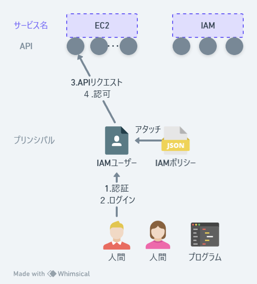
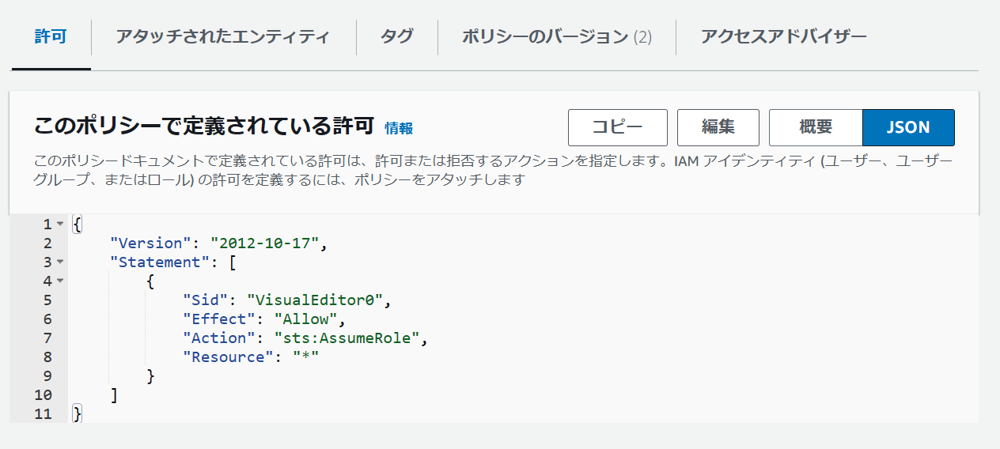
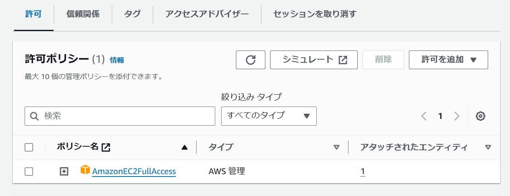
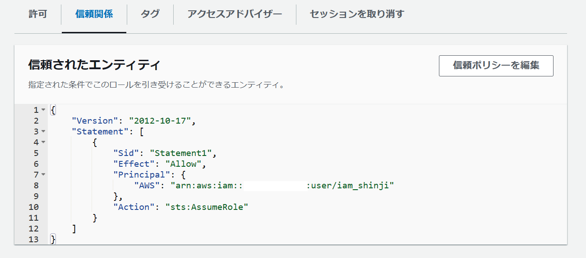
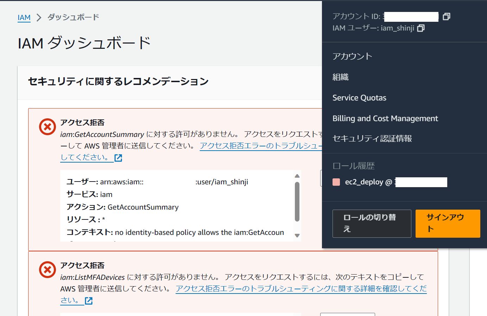
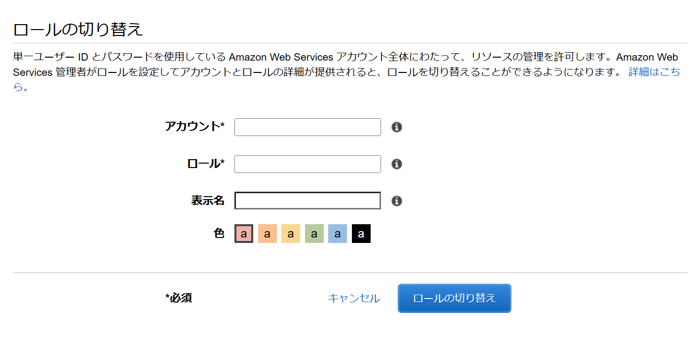

# キーワード
IAMロール、AssumeRole、IAMポリシー、信頼ポリシー

# 問題意識
どのようなユーザーで開発・デプロイ・運用すればいいのか全くわからない
- 個人開発
- 少数チーム開発
- 会社アカウント

それぞれのケースで最適な手法があるはず！

# 基本知識(認証と認可)

- AWSの様々なサービスを利用する主体に「IAMユーザー」というのがいる
- 人間やアプリケーションがこのIAMユーザーにログインするときに認証がおこなわれる
    - 人間がマネジメントコンソール経由でAWSサービスを利用する際はIDとパスワードで認証がおこなわれる
    - 人間がCLI経由で利用する場合はアクセスキーとシークレットアクセスキーで認証が行われる
    - アプリケーションがAWSサービスを利用するためには、プロセスの中でアクセスキーによる認証をおこなってIAMユーザーになる必要がある
    - いずれにせよ認証情報は永続的(パスワードやシークレットキーは自分で変えない限りはずっと有効)
- AWSでは個々のサービスがそれぞれAPIを公開していて、プリンシパルがAPI経由でアクションするたびに認可がおこなわれる
    - プリンシパル：実行主体のこと(ここではIAMユーザー)
    - アクション：ec2のインスタンスを作成、S3のbucketにログファイルを書き込む
    - リソース：中には客体を必要とするアクションもある
- 認可情報はIAMポリシーというjsonで管理されている
- 個々のポリシーはプリンシパルにアタッチされていて(厳密には間違いっぽい)、それで認可がおこなわれる

# IAMポリシーの例
- Json形式で記述されている。以下は`AmazonEC2FullAccess`の中身。
```json
{
    "Version": "2012-10-17",
    "Statement": [
        {
            "Action": "ec2:*",
            "Effect": "Allow",
            "Resource": "*"
        },
        {
            "Effect": "Allow",
            "Action": "elasticloadbalancing:*",
            "Resource": "*"
        },
        {
            "Effect": "Allow",
            "Action": "cloudwatch:*",
            "Resource": "*"
        },
        {
            "Effect": "Allow",
            "Action": "autoscaling:*",
            "Resource": "*"
        },
        {
            "Effect": "Allow",
            "Action": "iam:CreateServiceLinkedRole",
            "Resource": "*",
            "Condition": {
                "StringEquals": {
                    "iam:AWSServiceName": [
                        "autoscaling.amazonaws.com",
                        "ec2scheduled.amazonaws.com",
                        "elasticloadbalancing.amazonaws.com",
                        "spot.amazonaws.com",
                        "spotfleet.amazonaws.com",
                        "transitgateway.amazonaws.com"
                    ]
                }
            }
        }
    ]
}
```

以下は`AmazonS3FullAccess`の例
```json
{
    "Version": "2012-10-17",
    "Statement": [
        {
            "Effect": "Allow",
            "Action": [
                "s3:*",
                "s3-object-lambda:*"
            ],
            "Resource": "*"
        }
    ]
}
```

# IAMユーザーの問題点
- IAMユーザーは認証情報が永続化しているのでセキュリティ的によくない
    - アクセスキーとシークレットアクセスキーを奪われたらいろんなアクションをされてしまう
    - もしそのIAMユーザーに大きな権限ポリシーをアタッチしていたらあぶない
    - たとえば勝手にEC2インスタンスいっぱい作成されて仮想通貨マイニングされたりしちゃう
- つまり、ポリシーは一時的にアタッチするのが望ましい
    - EC2インスタンスを生成するときだけそのポリシーがアタッチされるようにする仕組み
- それではこれを解決するために「IAMロール大先生」に登場していただきましょう

# IAMロール
- ポリシーの寄せ集め
- より具体的には、IAM(アクセス管理)ポリシーと信頼ポリシーの２つを構成要素とする
    - IAMポリシーはプリンシパルがどのアクションを許可されるかをあらわしたもの
    - 信頼ポリシーはどのプリンシパルがsts:AssumeRoleというアクションを実行可能かをあらわしたもの
    - マネジメントコンソールでの該当場所

以下は信頼ポリシーの例
```json
{
    "Version": "2012-10-17",
    "Statement": [
        {
            "Effect": "Allow",
            "Principal": {
                "aws": "arn:aws:iam::123456789:user:iam_shinji",
            },
            "Action": "sts:AssumeRole"
        }
    ]
}
```
`iam_shinji`というIAMユーザーのみがsts::AssumeRoleアクションを実行できることを表している。

# AssumeRole アクションとは？
- AWSのSTS(security token service)というサービスのAPIでこれをたたくと、ロールを引き受けることができる。
- 上記はiam_shinjiというIAMユーザーのみがAssumeRoleできるということを表現したポリシー
- AssumeRoleが認可されると、STSサービスから一時的な認証情報が発行され、これでIAMロールにスイッチできる


# ハンズオンでおこなう手順
### 1.rootユーザーでログインして新規IAMユーザーを作成
### 2. sts:AssumeRoleだけ許可するIAMポリシーを作成してIAMユーザーにアタッチ

### 3. ec2をデプロイするためのIAMロールを新規に作成
### 4. IAMポリシーと信頼ポリシーを作成してそのロールにアタッチ

- `AmazonEC2FullAccess`というのはAWSにあらかじめ用意されているポリシー

### 5. rootユーザーからログアウトしてIAMユーザーでログイン
### 6. ロール切り替え

- 現在のIAMユーザーからはIAMサービスに対するアクションは何も許可されていないため、どんなロールがあるのかを読み込むこともできない
- ただマネジメントコンソールの場合、ブラウザのキャッシュに直近アシュームしたロール履歴が残っているためセキュリティ的には微妙

- 実際のスイッチ画面ではロール名を入力する必要があり、これは原理的にはルートユーザーしか知らない情報のため、セキュリティが担保されている。

# まとめ
- アクションはユーザーが個別のロールをAssumeRoleしてから行うのがいい。
- IAMユーザーはアシュームするロールに関する情報をなにひとつ持たないというのがポイント。
    - もしもっているなら悪意の第三者がIAMユーザーからロールをアシュームできてしまう
    - ロールに関する情報をもっているのはIAMユーザーにログインする人間(あるいはプログラム)


# 参考文献
- [IAMとは(AWS公式)](https://docs.aws.amazon.com/ja_jp/IAM/latest/UserGuide/introduction.html)
- [AWS Identity and Access Management のセキュリティのベストプラクティスとユースケース(AWS公式)](https://docs.aws.amazon.com/ja_jp/IAM/latest/UserGuide/IAMBestPracticesAndUseCases.html)
    - いろんなユースケースのベストプラクティス
- [くろかわこうへいのAWS講座IAM編#1【IAMロール、ポリシー、アクセスキー、ユーザー、グループ】](https://www.youtube.com/watch?v=uMB1toQ9Z7A)
- [くろかわこうへいのAWS講座IAM編#2【IAMポリシーの詳細】](https://www.youtube.com/watch?v=Je8AwcwczoY)
- [IAM ロールの PassRole と AssumeRole をもう二度と忘れないために絵を描いてみた](https://dev.classmethod.jp/articles/iam-role-passrole-assumerole/)
    - 図解でロールについてくわしくやってくれてる
- [AssumeRole（スイッチロール）を理解して、AWSへのデプロイを少しでも安全に実施しよう](https://www.youtube.com/watch?v=LbZj68v4k8I)
    - IAMユーザーがAssumeRoleしてcloud formationを使用し、cloud formationにPassRoleしてアプリケーションをデプロイさせるまでの手順。よさ。


# 用語確認(おまけ＆曖昧)
## リソース
- IAMサービスで作成したり修正したり削除したりできるもの
- IAMユーザー、IAMグループ、IAMロール、IAMポリシー
- ルートユーザーはリソースではない

## アイデンティティ
-　IAMポリシーをアタッチできるもの
- IAMユーザー、IAMグループ、IAMロール

## エンティティ
認証に用いるもの？

## プリンシパル
アクションを実行する主体

## IAMポリシー
- アイデンティティベースポリシー
    - アクセスポリシー
- リソースベースポリシー
    - 信頼ポリシー

- ロールを引き受けるアクション　sts:AssumeRole
- ロールを付与するアクション　sts:PassRole